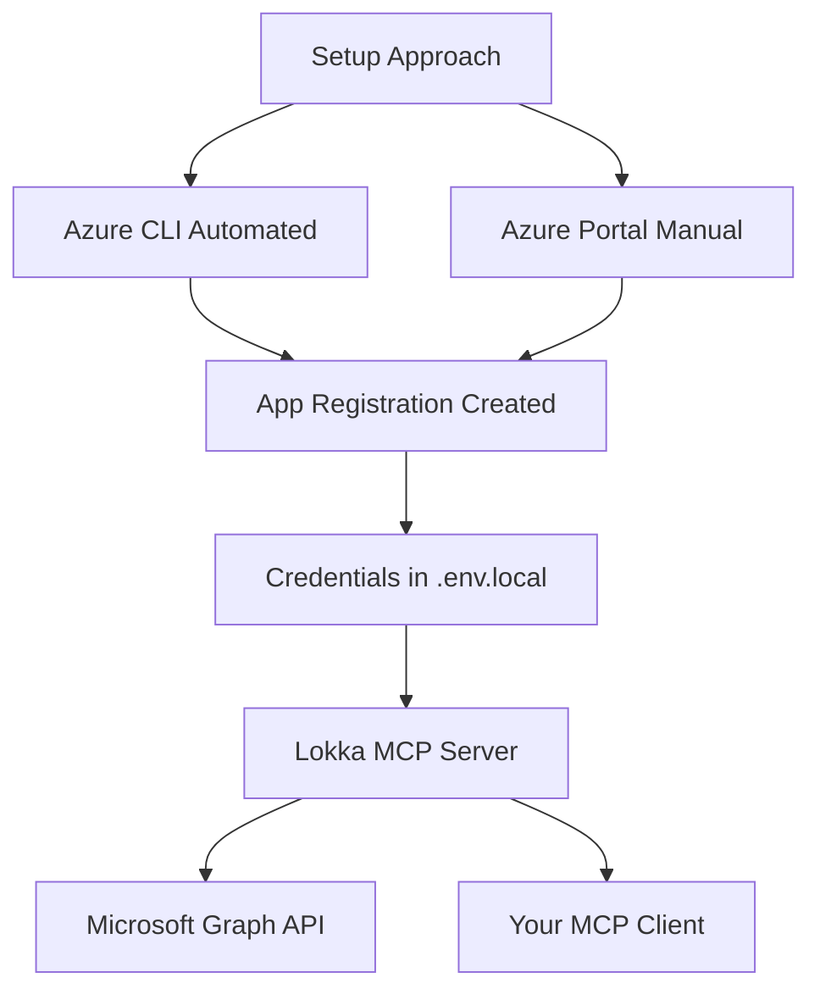

# Multi-Tenant Azure Management Guide

**Note**: This is the comprehensive implementation guide for multi-tenant Azure management using Lokka MCP servers.

## Overview

This guide covers the complete methodology for managing multiple Azure tenants through AI-powered interfaces, with emphasis on:

- Secure multi-tenant configuration
- License optimization and usage tracking
- Automated workflow development
- Team collaboration and version control

## Quick Start

**Choose Your Setup Approach:**

1. **MCP-Only Setup (Recommended)**
   - No Azure CLI dependency
   - Manual Azure Portal app registration
   - Pure MCP authentication at runtime
   - Follow [MCP-Only Setup Guide](mcp-only-setup-guide.md)

2. **Automated Setup (Azure CLI)**
   - Fully automated app registration
   - Requires Azure CLI installation
   - Run `./scripts/utilities/setup-azure-credentials.sh`
   - Follow [Quick Start Guide](quick-start-guide.md)

3. **Manual Setup (Azure CLI)**
   - Step-by-step with Azure CLI commands
   - Follow [Local Credential Setup Walkthrough](local-credential-setup-walkthrough.md)

4. **Troubleshooting**
   - Consult [Troubleshooting Guide](troubleshooting-guide.md) for common issues

**Runtime Operations (All Approaches):**
- All authentication flows through Lokka MCP servers
- No Azure CLI needed during normal operations
- Pure Graph API access via MCP interface

## Authentication Architecture

### Setup vs Runtime Authentication

It's important to understand the difference between **setup authentication** and **runtime authentication**:

**Setup Phase (One-time):**
- Creates Azure app registrations
- Generates client secrets
- Sets API permissions
- Can use Azure CLI (automated) OR Azure Portal (manual)

**Runtime Phase (Ongoing):**
- All authentication through Lokka MCP servers
- Direct Graph API access via service principal
- No Azure CLI dependency
- Pure MCP-based operations

### Authentication Flow Options



**Key Insight:** Azure CLI is **only needed for automated setup**. All runtime operations use pure MCP authentication, making the system lightweight and dependency-free for daily use.

## Business Context

### Target Tenants (Artificial Test Environment)

- **Dasein Research Group** (Primary Test Tenant) - Simulated established organization for testing mature configurations
- **Spectral Solutions** (Secondary Test Tenant) - Simulated growing organization for testing scalability patterns

**Note**: These are entirely artificial tenants created for testing and demonstration purposes. All user activities, behaviors, and organizational patterns will be driven directly through these workflows or by administrative actions to simulate realistic Microsoft 365 usage scenarios.

### Key Objectives

1. **Unified Management Interface** - Single AI model interface for multi-tenant operations testing via MCP servers
2. **Security Isolation** - Validate proper tenant separation with individual authentication
3. **Operational Efficiency** - Test tenant switching and cross-tenant comparison capabilities
4. **Audit Trail** - Demonstrate comprehensive logging of all tenant interactions
5. **Active Usage Simulation** - Generate realistic Microsoft 365 license utilization patterns for optimization testing

## Architecture & Design Philosophy

### Multi-Tenant Strategy

The approach leverages multiple Lokka MCP server instances, each configured for a specific tenant. These MCP servers can be accessed through various AI model interfaces:

**Supported Client Interfaces:**

- Claude Desktop (Anthropic)
- VS Code with GitHub Copilot Studio
- Any MCP-compatible AI model client

**MCP Server Configuration:**

```config
MCP Server Architecture
├── Lokka-Dasein-Research (Tenant 1)
│   ├── Tenant ID: ef63f3e9-134f-428f-b601-1bfe781034f8
│   ├── Client ID: 16554e45-c734-480d-bb04-9f9fe7a3ab5e
│   └── Client Secret: [Configured]
│
└── Lokka-Spectral-Solutions (Tenant 2)
    ├── Tenant ID: 049d5c8d-0cb4-4880-bc97-8a770b44be56
    ├── Client ID: 15315bba-3aa4-46c6-be01-955198f119e0
    └── Client Secret: [To be configured]
```

### Security Model

#### Principle of Least Privilege

- Each MCP server has tenant-specific application registrations
- API permissions are scoped to essential operations only
- Client secrets are isolated per tenant with appropriate expiration

##### Recommended Permission Set

- `User.Read.All` - User directory access
- `Group.Read.All` - Group and membership information
- `Application.Read.All` - Application inventory
- `Directory.Read.All` - Directory structure and configuration
- `Policy.Read.All` - Security policies and conditional access
- `AuditLog.Read.All` - Compliance and audit trail
- `Reports.Read.All` - Usage and activity reports
- `DeviceManagementConfiguration.Read.All` - Intune configuration
- `DeviceManagementManagedDevices.Read.All` - Device inventory

### Client Interface Flexibility

The MCP server architecture is designed to be platform-agnostic, supporting multiple client interfaces for maximum operational flexibility:

**VS Code with GitHub Copilot Studio (Recommended for Teams):**

- Integrated development environment for automation workflows
- Code generation and script automation capabilities  
- Version control integration with GitHub for configuration management
- Extension ecosystem for enhanced functionality
- Collaborative development of automation scripts
- Built-in terminal for command execution
- Workspace sharing and team collaboration features

**Claude Desktop:**

- Native MCP support with direct configuration
- Excellent natural language processing for complex queries
- Real-time interaction capabilities

**Any MCP-Compatible Client:**

- Anthropic Claude (via web interface or API)
- OpenAI GPT models with MCP support
- Custom applications via MCP SDK
- Command-line tools and automation scripts
- API-driven integration with existing workflows

**Benefits of Multi-Client Approach:**

- Team members can use their preferred interface
- Automation scripts can be version-controlled and shared
- Different interfaces optimized for different tasks
- No vendor lock-in or single point of failure
- Flexibility to adapt to changing organizational needs

### Automation and Scripting Benefits

**VS Code Integration Advantages:**

- **Reproducible Workflows**: Scripts and automation can be version-controlled in GitHub
- **Team Collaboration**: Shared workspaces allow multiple team members to contribute
- **Continuous Integration**: Automated testing of tenant configurations
- **Documentation as Code**: Markdown files alongside automation scripts
- **Extension Ecosystem**: Leverage Azure extensions, GitHub Copilot, and other tools
- **Terminal Integration**: Execute MCP queries and Azure CLI commands in same environment

**Scripting Capabilities:**

- PowerShell scripts for complex multi-tenant operations
- Python automation for data analysis and reporting
- Bash scripts for Unix/Linux environments
- Custom MCP client applications
- API integration with existing tools and workflows

## Implementation Phases

### Phase 1: Foundation Setup ✅

- [x] Repository structure and documentation
- [x] Secret management configuration
- [x] VS Code workspace setup
- [x] Local credential setup automation
- [x] Authentication testing and validation

### Phase 2: Multi-Tenant Configuration 🚧

- [ ] MCP server deployment
- [ ] Cross-platform testing
- [ ] Automation script development

### Phase 3: Operational Validation 📋

- [ ] User account population
- [ ] Usage pattern simulation
- [ ] License optimization testing

### Phase 4: Documentation & Automation 📝

- [ ] Standard operating procedures
- [ ] Emergency procedures
- [ ] Team knowledge transfer

## Navigation

- **[Guides](../guides/)** - Step-by-step implementation instructions
- **[References](../references/)** - Technical documentation and API references
- **[Templates](../templates/)** - Reusable templates and prompts
- **[Workflows](../../workflows/)** - Generic and specific workflow examples
- **[Scripts](../../scripts/)** - Automation utilities and tools

## Security Considerations

This guide implements security best practices including:

- Environment-based secret management
- Tenant isolation validation
- Audit logging requirements
- Credential rotation procedures

For detailed security implementation, see [Secret Management Guide](../references/secret-management.md).
